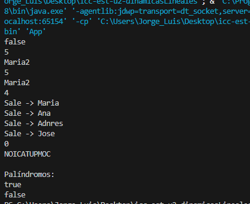

# Práctica: Estructuras Dinámicas Lineales

## Datos del Estudiante
- **Nombre:** Jorge Luis Padilla
- **Curso:** Grupo 3
- **Fecha:** 8/6/2026

---

## 1. Implementación de estructuras dinámicas lineales

**Fecha:** 8/6/2026

**Descripción:**

En esta práctica se implementaron diferentes estructuras dinámicas lineales utilizando Java Collections Framework.

### Captura de salida en consola



### Captura del código de implementación del ejercicio 1
````java
    public String invertString(String texto) {
       // Stack;
        ArrayDeque<Character> pila = new ArrayDeque<>();
 
        // for (int i = 0; i < texto.length(); i++) {
        // pila.push(texto.charAt(i)); // (5) COMPUTACION O(N)
        // } // O(n^2)
 
        // texto.toCharArray(); //[C, O, M, T]. [5] =T O(1)
 
        for (char letra : texto.toCharArray()) {
            pila.push(letra);
        } // O(n)
 
        String invertido = "";
 
        while (!pila.isEmpty()) {
            char letra = pila.pop();
            invertido += letra;
        }
 
        return invertido;
    }
````
## 2. Ejercicio Palíndromo

**Fecha:** 9/6/2026

**Descripción:**
Se desarrolló un método llamado esPalindromo(String texto) que permite verificar si una palabra es palíndroma.

La solución utiliza una pila para invertir el texto y posteriormente comparar el resultado con la cadena original.

Si ambos textos son iguales, el método retorna true; caso contrario, retorna false.


### Método implementado

````java
public boolean esPalindromo(String texto) {
    public boolean esPalindromo(String texto) {
        Deque<Character> pila = new ArrayDeque<>();

        for (char letra : texto.toCharArray()) {
            pila.push(letra);
        }
        
        String invertido = "";
 
        while (!pila.isEmpty()) {
            char letra = pila.pop();
            invertido += letra;
        }

        if (invertido.equalsIgnoreCase(texto)) {
            return true;
        }else{
            return false;
        }
    }
}